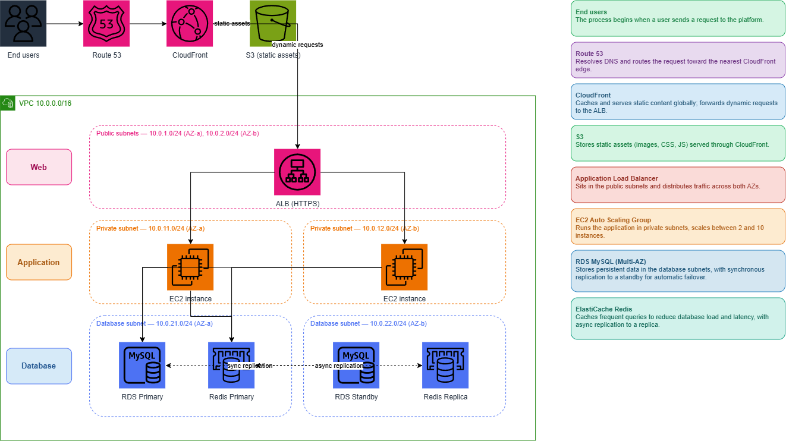

# RetailEdge — AWS Cloud Infrastructure

> **Production-style three-tier AWS architecture implemented with Terraform, Auto Scaling, managed data services, security controls, monitoring, and GitHub Actions-based deployment.**


---

## 1. Project Overview

RetailEdge is an AWS cloud-infrastructure project built around a three-tier application architecture. The project converts the original infrastructure requirements into a modular AWS implementation with clear separation between the **network**, **application/compute**, **data**, and **delivery/operations** concerns.

The infrastructure is defined as code and organized into independent Terraform layers so that each part can be provisioned, validated, and reviewed separately.

### Project goals

- Build a secure three-tier AWS network.
- Separate public, application, and database workloads.
- Deploy the application behind an Application Load Balancer.
- Use a Launch Template and Auto Scaling Group for repeatable compute provisioning.
- Use managed MySQL and Redis services for persistent and cached data.
- Apply IAM and Security Group controls between tiers.
- Automate infrastructure validation with GitHub Actions.
- Automate application packaging and deployment using GitHub Actions, S3, and AWS Systems Manager.
- Add CloudWatch monitoring for application, database, and cache signals.
- Keep the sandbox environment cost-conscious while maintaining the target architectural boundaries.

---

## 2. Architecture



### High-level design

The target design follows a layered three-tier model:

```text
                         End Users
                             |
                       Route 53 / DNS
                             |
                         CloudFront
                             |
                 +-----------+-----------+
                 |                       |
             Static Assets          Dynamic Traffic
                 |                       |
                S3                      ALB
                                         |
                              +----------+----------+
                              |                     |
                         Private AZ-1          Private AZ-2
                              |                     |
                           EC2/ASG              EC2/ASG
                              |                     |
                              +----------+----------+
                                         |
                         +---------------+---------------+
                         |                               |
                      RDS MySQL                    ElastiCache Redis

```

The diagram represents the **target architecture/design**. The Terraform implementation is the source of truth for what is actually provisioned in the current repository.


---

## 3. Terraform Layered Structure

The infrastructure is split into five logical layers:

```text
Layer 1 — Architecture & Documentation
        |
        v
Layer 2 — Network Foundation & Security
        |
        v
Layer 3 — Compute & Auto Scaling
        |
        v
Layer 4 — Data Services
        |
        v
Layer 5 — CI/CD, Monitoring & Go-Live
```

### Repository structure

```text
retailedge-aws/
├── .github/
│   └── workflows/
│       ├── deploy.yml
│       └── terraform-check.yml
│
├── app/
│   └── app.py
│
├── ami/
│   └── user-data.txt
│
├── architecture/
│   ├── RetailEdge_arch.png
│   ├── architecture-design.md
│   ├── migration-strategy.md
│   └── tco.md
│
├── docs/
│   ├── Q&A Notes.md
│   ├── go-live-checklist.md
│   └── pricing/
│
├── environments/
│   ├── sandbox/
│   └── production/
│
└── layers/
    ├── layer-01-architecture/
    ├── layer-02-network/
    ├── layer-03-compute/
    ├── layer-04-data/
    └── layer-05-cicd/
```

Each infrastructure layer contains its own Terraform configuration, variables, outputs, and supporting documentation where required.

---

# 4. Layer 1 — Architecture & Migration Design

Layer 1 is documentation-focused and does not create AWS resources.

It contains:

- High-level architecture design.
- Migration strategy.
- AWS service selection decisions.
- Target three-tier architecture.
- Cost/TCO documentation.
- Go-live and migration planning material.

The architecture diagram documents the intended end-state, while the Terraform layers define the resources selected for actual implementation.

---

# 5. Layer 2 — Network Foundation & Security

The network layer creates the base AWS networking required by the application.

### VPC

- CIDR: `10.0.0.0/16`
- DNS support enabled.
- DNS hostnames enabled.
- Region: `us-east-1`.

### Availability Zones

The default network design uses:

- `us-east-1a`
- `us-east-1b`

### Subnet segmentation

| Tier | Subnets | CIDR ranges |
|---|---:|---|
| Public / Web | 2 | `10.0.1.0/24`, `10.0.2.0/24` |
| Private / Application | 2 | `10.0.11.0/24`, `10.0.12.0/24` |
| Database | 2 | `10.0.21.0/24`, `10.0.22.0/24` |

### Routing

- One public route table provides the default Internet route through the Internet Gateway.
- Private application subnets have dedicated route tables.
- Database subnets use a dedicated database route table.
- The sandbox does not deploy a NAT Gateway, keeping outbound infrastructure costs lower.

### Security Groups

Traffic is restricted by security-group references rather than broad application-to-database access:

```text
Internet
   |
   | 80 / 443
   v
 ALB SG
   |
   | 8080
   v
 App SG
   |\
   | \ 6379
   |  v
   | Redis SG
   |
   | 3306
   v
 RDS SG
```

The application tier accepts port `8080` traffic from the ALB security group. RDS accepts MySQL traffic on `3306` from the application security group, while Redis accepts `6379` from the application security group.

---

# 6. Layer 3 — Load Balancing, Compute & Auto Scaling

## Application Load Balancer

The compute layer creates an **internet-facing Application Load Balancer** in the public subnets.

The ALB is connected to a target group configured for:

- Protocol: `HTTP`
- Application port: `8080`
- Target type: EC2 instances
- Health-check path: configurable
- Health-check protocol: HTTP
- Health-check interval: `30s`
- Timeout: `5s`
- Healthy threshold: `2`
- Unhealthy threshold: `3`

The HTTP listener can either forward directly to the target group for sandbox validation or redirect to HTTPS when an ACM certificate is supplied.

## Launch Template

The Launch Template provides repeatable EC2 configuration using:

- Golden AMI.
- Configurable instance type.
- Application Security Group.
- IAM Instance Profile.
- Instance tagging.
- IMDSv2 with required session tokens.

The AMI used during the sandbox validation was:

```text
ami-003435f90dd012242
```

The application runs on port `8080`.

## Auto Scaling Group

The ASG launches instances into the private application subnets and attaches them to the ALB target group.

It uses:

- ELB health checks.
- A `300` second health-check grace period.
- Rolling instance refresh.
- `90%` minimum healthy percentage during refresh.
- Target tracking based on `ASGAverageCPUUtilization`.

The production profile is designed around a `2 / 2 / 10` minimum / desired / maximum capacity model, while the sandbox profile uses smaller cost-controlled capacity.

---

# 7. Layer 4 — Data Services

## Amazon RDS for MySQL

The data layer provisions a managed MySQL database using:

- MySQL `8.0`.
- Encrypted storage.
- Database subnet group using the two database subnets.
- Security Group isolation from the application tier.
- Port `3306`.
- Configurable backup retention.

The production profile supports Multi-AZ deployment. The sandbox profile intentionally uses Single-AZ with `db.t3.micro` to reduce cost during validation.

## ElastiCache for Redis

Redis is provisioned as an optional replication group in the database subnet tier.

The configuration supports:

- Configurable node type.
- Configurable node count.
- Multi-AZ and automatic failover when more than one node is configured.
- At-rest encryption.
- Transit encryption.
- Security Group isolation.

The sandbox example uses one `cache.t3.micro` node, while the Terraform resource supports multi-node configurations for higher availability.

## S3

The project uses private S3 buckets for application assets and CI artifacts.

The bucket configuration includes:

- Public access blocked.
- Versioning enabled.
- Server-side encryption using AES-256.
- Optional Intelligent-Tiering for application assets.

---

# 8. Layer 5 — CI/CD & Operations

The current deployment implementation uses **GitHub Actions + AWS OIDC + S3 + AWS Systems Manager**.

### Application deployment flow

```text
GitHub push to main
        |
        v
GitHub Actions
        |
        +--> Python compilation check
        |
        +--> Local application smoke test
        |
        +--> Package application as ZIP
        |
        v
AWS OIDC authentication
        |
        v
Private S3 artifact bucket
        |
        v
AWS Systems Manager Run Command
        |
        v
RetailEdge EC2 instances
        |
        +--> Extract application
        +--> Compile application
        +--> Restart systemd service
        +--> /health validation
```

### GitHub OIDC

GitHub Actions authenticates to AWS through an IAM OIDC trust relationship instead of storing long-lived AWS access keys in the repository.

The trust policy is restricted to the RetailEdge GitHub repository using the repository owner and repository identifiers.

### EC2 IAM role

Application instances use an IAM instance profile with:

- `AmazonS3ReadOnlyAccess`
- `AmazonSSMManagedInstanceCore`

This allows the instances to retrieve application artifacts and be managed through Systems Manager without requiring SSH-based deployment automation.

---

# 9. Monitoring

CloudWatch alarms are defined for the main operational signals:

| Alarm | Metric | Threshold |
|---|---|---:|
| High latency | ALB p95 `TargetResponseTime` | `> 800 ms` |
| High error rate | ALB 5xx percentage | `> 1%` |
| Database CPU | RDS `CPUUtilization` | `> 80%` |
| Low cache hit rate | ElastiCache hit percentage | `< 70%` |

The alarms use five-minute evaluation periods and are configured as monitoring controls for the deployed environment.

---

# 10. Application

RetailEdge includes a lightweight dependency-free Python HTTP application used to validate the infrastructure path.

### Endpoints

| Endpoint | Purpose |
|---|---|
| `/` | Returns the RetailEdge application response |
| `/health` | Returns `200 OK` for load-balancer health checks |
| `/info` | Returns service/deployment information |

The application listens on:

```text
0.0.0.0:8080
```

The AMI bootstrap script installs Python and creates a `retailedge.service` systemd unit with automatic restart behavior.

---

# 11. Infrastructure as Code

Terraform is the source of truth for the infrastructure implementation.

Important Terraform resources include:

### Networking

- `aws_vpc`
- `aws_internet_gateway`
- `aws_subnet`
- `aws_route_table`
- `aws_route_table_association`
- VPC security-group rule resources

### Compute

- `aws_lb`
- `aws_lb_target_group`
- `aws_lb_listener`
- `aws_launch_template`
- `aws_autoscaling_group`
- `aws_autoscaling_policy`
- `aws_autoscaling_schedule`

### Data

- `aws_db_subnet_group`
- `aws_db_instance`
- `aws_elasticache_subnet_group`
- `aws_elasticache_replication_group`
- `aws_s3_bucket`
- S3 access-block, versioning, encryption, and tiering resources

### Identity & operations

- IAM roles and instance profiles.
- GitHub Actions OIDC role.
- CloudWatch metric alarms.

The layer separation makes the infrastructure easier to validate, troubleshoot, and evolve independently.

---

# 12. Validation & Quality Checks

Terraform validation is automated for Layers 2–5 through GitHub Actions.

For each layer the workflow runs:

```bash
terraform fmt -check -recursive
terraform init -backend=false
terraform validate
```

The application deployment workflow additionally performs:

```text
Python compilation
        ↓
Application smoke test
        ↓
Package creation
        ↓
AWS identity verification
        ↓
S3 artifact upload
        ↓
SSM deployment
        ↓
Application health check
```

This provides both **Infrastructure as Code validation** and **application deployment validation**.

---

# 13. Sandbox vs Production

The repository intentionally separates sandbox and production configuration.

### Sandbox

The sandbox profile is designed for affordable validation:

- Smaller EC2 Auto Scaling range.
- `db.t3.micro` RDS instance.
- Single Redis node.
- No NAT Gateway.
- No container/ECR dependency.
- No CodeDeploy dependency.
- HTTP ALB validation is supported when no ACM certificate is configured.

### Production

The production configuration preserves the intended high-availability direction, including:

- Two application instances as the baseline ASG capacity.
- Maximum ASG capacity of `10`.
- RDS Multi-AZ support.
- Multi-node Redis capability.
- Production-oriented network and availability boundaries.

This separation allows the architecture to remain production-oriented without forcing unnecessary sandbox costs.

---

# 14. Security Principles

The implementation follows several practical security controls:

- Private application and database subnet tiers.
- Security Group references between application tiers.
- Database access limited to the application Security Group.
- Redis access limited to the application Security Group.
- S3 public access blocked.
- S3 server-side encryption enabled.
- IMDSv2 required on EC2 Launch Templates.
- IAM roles used instead of embedding AWS credentials in instances.
- GitHub Actions uses OIDC instead of long-lived AWS keys.
- Sensitive database passwords are excluded from committed example configuration.

No credentials, access keys, private keys, or database secrets are stored in the repository.

---

# 15. Migration & Go-Live Documentation

The repository also contains supporting design material for the broader migration scenario, including:

- Architecture design.
- Migration strategy.
- Database migration planning.
- RPO/RTO considerations.
- Cache hit/miss analysis.
- Go-live checklist.
- Production pricing estimate.
- Project Q&A and implementation notes.

Some AWS services in the original target architecture are documented as **migration/design components** rather than deployed sandbox resources. This distinction keeps the documentation aligned with the actual Terraform implementation.

---

# 16. Key Implementation Summary

| Area | Implemented capability |
|---|---|
| Architecture | Three-tier AWS design with clear network/application/data separation |
| Networking | VPC, six subnets, multi-AZ subnet layout, route tables, Internet Gateway |
| Security | Tiered Security Groups, IAM roles, private subnets, IMDSv2, encrypted storage |
| Load balancing | Internet-facing ALB + HTTP target group + health checks |
| Compute | Launch Template + Golden AMI + EC2 Auto Scaling Group |
| Scalability | CPU target tracking + rolling instance refresh + optional scheduled scaling |
| Database | Managed MySQL with encrypted storage and configurable Multi-AZ |
| Caching | ElastiCache Redis with encryption and multi-node failover support |
| Storage | Private versioned and encrypted S3 buckets |
| CI/CD | GitHub Actions, OIDC, S3 artifacts, SSM-based deployment |
| Monitoring | CloudWatch alarms for ALB, RDS, and Redis |
| Validation | Automated Terraform checks and application smoke/health checks |
| Documentation | Architecture, migration, pricing, go-live, and implementation notes |

---

# 17. Quick Start

Clone the repository:

```bash
git clone https://github.com/Youssef-Mohamd/retailedge-aws.git
cd retailedge-aws
```

Validate a layer:

```bash
cd layers/layer-02-network
terraform fmt -check -recursive
terraform init -backend=false
terraform validate
```

Repeat the validation process for:

```text
layers/layer-03-compute
layers/layer-04-data
layers/layer-05-cicd
```

Environment-specific example variables are provided under:

```text
environments/sandbox/
environments/production/
```

Review the variables and AWS account configuration before running `terraform plan` or `terraform apply`.

---

# 18. Project Deliverables

The repository provides:

- Terraform infrastructure organized by implementation layer.
- AWS three-tier architecture documentation.
- Application source code.
- Golden AMI bootstrap configuration.
- Security and IAM configuration.
- Auto Scaling and load-balancing configuration.
- RDS and Redis infrastructure.
- S3 storage configuration.
- GitHub Actions workflows.
- CloudWatch monitoring configuration.
- Migration and go-live documentation.
- Production pricing estimate.

---

## Repository

**RetailEdge AWS Cloud Infrastructure**  
https://github.com/Youssef-Mohamd/retailedge-aws

---

## Final Note

RetailEdge demonstrates an end-to-end Infrastructure as Code workflow: **design → network foundation → secure compute → managed data services → automated deployment → monitoring → validation**.

The repository intentionally distinguishes between the **target architecture** and the **resources actually implemented in Terraform**, making it clear which capabilities are deployed, configurable, or documented as future production/migration components.
